<!-- Banner -->
<!-- <div align="center">
  
</div> -->

<!-- Dark Background Banner -->

<!-- Left Aligned Banner -->
<!-- <div align="left" style="background: #000000; padding: 20px 30px; border-radius: 12px; margin: 10px 0;">
  <p align="left">
    
  </p>
</div> -->
<!-- ====== PROFILE CARD ====== -->

<!-- SVG Profile Card - Direct Root -->
<!-- <div align="center">
  
</div> -->

 <div align="center">
  
</div>

<p align="center">
  
</p>
<!-- <h2>🧠 About Me</h2>

<table>
<tr>

<td width="32%" align="center">


</td>

<td width="68%" valign="top">

<h3>Hey there! I'm <b>Divyang Upreti</b></h3>

I'm an AI/ML Engineer and Full Stack Developer passionate about building intelligent software, scalable backend systems and modern web applications.

By day, I'm learning new technologies and building real-world projects.

By night, you'll usually find me experimenting with AI, LLMs, RAG systems, Blockchain or contributing to open-source projects.

### 🚀 Current Focus

• Artificial Intelligence & Machine Learning

• Full Stack Development

• LLMs & RAG Systems

• Cloud & DevOps

• Software Engineering

</td>

</tr>
</table> -->

<h1 align="center"><b>✦ 𝐀𝐛𝐨𝐮𝐭 𝐌𝐞 & 𝐖𝐡𝐚𝐭 𝐃𝐫𝐢𝐯𝐞𝐬 𝐌𝐞 ✦</b></h1>


## 👨🏻‍💻 𝐀𝐛𝐨𝐮𝐭 𝐌𝐞 & 𝐖𝐡𝐚𝐭 𝐃𝐫𝐢𝐯𝐞𝐬 𝐌𝐞

```yaml
name: Divyang Upreti
located_in: India
current_role: AI & Full-Stack Software Developer

education:
  - Bachelor's in Computer Science — SRM University (2023–2027)

fields_of_interests:
  - Artificial Intelligence
  - Full-Stack Development
  - Cloud & DevOps
  - Machine Learning
  - Blockchain & Web3
  - Real-Time Systems
  - Open Source Contribution

technical_background:
  - Built SHEild — AI-powered Women Safety System (Real-time Alerts, Live Tracking)
  - Created Spark AI — Voice Assistant with STT/TTS + OpenAI
  - Developed TOMATO — MERN Food Ordering System (Stripe, JWT, Admin Dashboard)
  - Experience with React, Next.js, Spring Boot, FastAPI, TensorFlow, PyTorch

currently_learning:
  - Advanced AI|ML Systems, LLMs, MLOps & Machine Learning
  - Docker, Next.js, Spring Boot
  - Blockchain Development (Solidity, Smart Contracts, Web3.js)

goals_2025:
  - Build more AI-driven and Web3-powered products
  - Become an expert in scalable backend architectures
  - Contribute deeply to open source

hobbies:
  - Coding
  - Exploring AI|ML & Blockchain Tools
  - Music
  - UI/UX & Tech Research

```
<div align="center">
  
</div>


<div align="center">
  
</div>


<div align="center">
  
</div>


<div align="center">
  
</div>


<div align="center">
  
</div>


<div align="center">

## 🚀 <b>𝐋𝐚𝐧𝐠𝐮𝐚𝐠𝐞𝐬, 𝐓𝐨𝐨𝐥𝐬 & 𝐓𝐞𝐜𝐡𝐧𝐨𝐥𝐨𝐠𝐢𝐞𝐬</b>
<p align="center"> <!-- Core Languages -->       <!-- Web Technologies -->        <!-- Databases -->      <!-- DevOps & Cloud -->      <!-- AI/ML Tools -->      <!-- Testing Tools -->    <!-- Tools & IDEs -->      <!-- UI/UX Tools -->   <!-- Operating Systems -->    <!-- Extra Tools -->       </p>

<div align="center">
  <div style="
    width: 90%;
    height: 5px;
    background: #a855f7;
    box-shadow: 0 0 15px 3px #a855f7;
    border-radius: 10px;
    margin-top: 20px;
  "></div>
</div>
<h2 align="center">📫 𝐂𝐨𝐧𝐧𝐞𝐜𝐭 𝐖𝐢𝐭𝐡 𝐌𝐞</h2>

<p align="center">

 
  <a href="https://www.linkedin.com/in/divyangupreti2/" target="_blank">
    
  </a>


  <a href="mailto:upretidivyang@gmail.com" target="_blank">
    
  </a>

  
<a href="https://github.com/DivyangUGitHub" target="_blank">
  
</a> 


</p>


